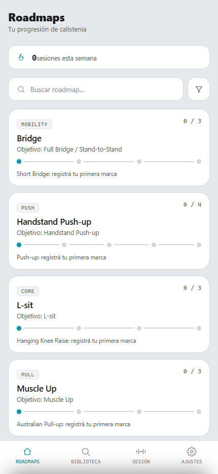
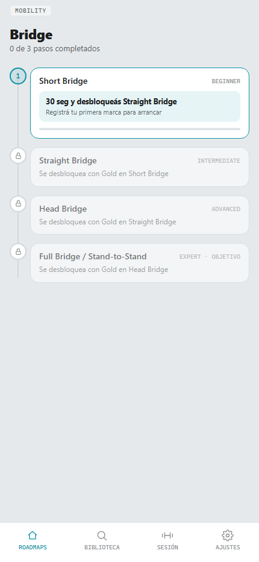
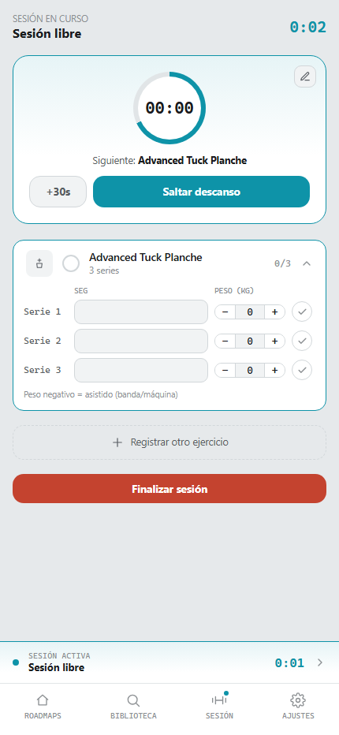
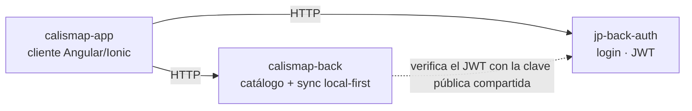

# CalisMap — `calismap-app`

**[English](#english)** &nbsp;|&nbsp; **[Español](#español)**

---

## English

Angular/Ionic frontend for the app. This is what a user actually opens, on their phone or in a browser.

### What is CalisMap

CalisMap is a calisthenics (bodyweight strength training) progression tracker. Instead of a generic workout log, every skill — Muscle Up, Handstand Push-up, Pistol Squat, L-sit, Planche, Bridge — is a **roadmap**: a chain of exercise steps, each one unlocking the next once you reach a rating tier (Bronze → Silver → Gold → Platinum → Diamond) on it, computed automatically from the reps/seconds/weight you log. Login is optional: the app works fully as a guest, local-first; a real account (Google) is only asked for at moments with an actual reason — finishing a session, creating your own exercise or routine, completing a roadmap — or to sync across devices.

### Screenshots

| Roadmaps | Progression path | Active session |
|---|---|---|
|  |  |  |

### What this repo does

- The entire app a user sees: Roadmaps (progression paths) → Roadmap detail → Exercise detail, Exercise library (search + filter), workout sessions (free or from a routine, with a rest timer you can adjust mid-rest), Settings, and an admin panel for the three of us who curate the catalog.
- Rating engine: reps/seconds/weight logged against a step's thresholds compute its Bronze/Silver/Gold/Platinum/Diamond tier client-side, which is what actually unlocks the next step in a roadmap.
- Local-first data: workout sessions, logged sets, personal routines and custom exercises live in `@ionic/storage-angular` (IndexedDB) first, synced to `calismap-back` in the background — the app works fully offline for anything you own.
- Catalog (roadmaps/exercises/routines curated by an admin) is pull-and-cache: fetched from `calismap-back` network-first on every cold start, cached locally only as an offline fallback.
- Admin panel (`/admin/**`, role-gated): full CRUD for roadmaps/exercises/routines, reusing the same exercise/routine editors a regular user uses for their own content, plus a read-only user list.
- `/catalog-sources`: tells any user, with real links, where the catalog's progressions and rating thresholds actually come from — and is honest that most of the numeric thresholds are reasoned estimates, not all individually sourced from a published standard.

### Architecture

Three repos. No API gateway in front of these two — the client calls both backends directly. No shared-types package either (unlike this author's other apps): the `AuthUser`/token contract is copied by hand into `core/models/auth-user.model.ts`, since this trio isn't set up as a monorepo with `file:` dependencies.


### Stack


Angular 21 (standalone components, signals, `@if`/`@for`) + Ionic Angular 8 (standalone) for the mobile shell — animations and the iOS swipe-back gesture are deliberately off (`provideIonicAngular({ animated: false, swipeBackEnabled: false })`), since this app owns its own page transitions. `@ionic/storage-angular` for local-first data, plain `localStorage` for auth tokens only (needs synchronous reads in the route guard and interceptor). No NgRx — state lives in the relevant service, mostly as signals.

### Testing

No committed automated suite yet — that's a real gap, not a hidden one. Every feature has been verified manually and with one-off Playwright scripts driving the real running stack (real HTTP calls to `calismap-back`/`jp-back-auth`, nothing mocked) during development, but those scripts live outside this repo rather than as a maintained test suite. `vitest` is wired up (`ng test`) but only covers the CLI-generated boilerplate spec so far.

### How to run it

```
npm install
npm start        # ng serve, port 4200
```

Needs the rest of the stack running to show real data: `jp-back-auth` (port 4001) and `calismap-back` (port 4004). Both URLs, plus the Google OAuth Client ID, live in `src/environments/environment.ts`.

### Related repos

- `../../jp-back/calismap-back` — catalog (roadmaps/exercises/routines) and the local-first sync endpoint this app talks to.
- `../../jp-back/jp-back-auth` — shared login/identity service (guest + Google), also used by this author's other apps.

---

## Español

Frontend Angular/Ionic de la app. Es lo que abre un usuario de verdad, en su teléfono o en el navegador.

### Qué es CalisMap

CalisMap es un rastreador de progresión de calistenia (entrenamiento de fuerza con el propio peso corporal). En vez de un registro de entrenamiento genérico, cada habilidad — Muscle Up, Handstand Push-up, Pistol Squat, L-sit, Planche, Bridge — es un **roadmap**: una cadena de ejercicios donde cada paso desbloquea el siguiente al alcanzar un nivel de rating (Bronce → Plata → Oro → Platino → Diamante), calculado automáticamente a partir de las repeticiones/segundos/peso que registrás. El login es opcional: la app funciona completa como invitado, local-first; una cuenta real (Google) solo se pide en momentos con un motivo real — terminar una sesión, crear tu propio ejercicio o rutina, completar un roadmap — o para sincronizar entre dispositivos.

### Capturas

| Roadmaps | Ruta de progresión | Sesión activa |
|---|---|---|
|  |  |  |

### Qué hace este repo

- Toda la app que ve un usuario: Roadmaps (rutas de progresión) → Detalle de roadmap → Detalle de ejercicio, Biblioteca de ejercicios (búsqueda + filtro), sesiones de entrenamiento (libres o desde una rutina, con temporizador de descanso ajustable a mitad de descanso), Ajustes, y un panel de administración para quienes curamos el catálogo.
- Motor de rating: repeticiones/segundos/peso registrados contra los umbrales de un paso calculan su nivel Bronce/Plata/Oro/Platino/Diamante del lado del cliente, que es lo que realmente desbloquea el siguiente paso de un roadmap.
- Datos local-first: sesiones de entrenamiento, series registradas, rutinas propias y ejercicios personalizados viven primero en `@ionic/storage-angular` (IndexedDB), sincronizados con `calismap-back` en segundo plano — la app funciona completa sin conexión para todo lo propio.
- El catálogo (roadmaps/ejercicios/rutinas curados por un admin) es pull-and-cache: se pide a `calismap-back` primero por red en cada arranque frío, el caché local solo se usa como respaldo sin conexión.
- Panel de administración (`/admin/**`, protegido por rol): CRUD completo de roadmaps/ejercicios/rutinas, reusando los mismos editores de ejercicio/rutina que ya usa un usuario normal para lo propio, más una lista de usuarios de solo lectura.
- `/catalog-sources`: le cuenta a cualquier usuario, con links reales, de dónde sale el catálogo y sus umbrales de rating — con honestidad sobre que la mayoría de los umbrales numéricos son estimaciones razonadas, no todos respaldados individualmente por un estándar publicado.

### Arquitectura

Tres repos. No hay gateway delante de estos dos backends — el cliente llama a ambos directo. Tampoco hay paquete de tipos compartido (a diferencia de otras apps de este mismo autor): el contrato de `AuthUser`/tokens se copia a mano en `core/models/auth-user.model.ts`, porque este trío no está armado como monorepo con dependencias `file:`.



### Stack


Angular 21 (componentes standalone, signals, `@if`/`@for`) + Ionic Angular 8 (standalone) para el shell mobile — las animaciones y el gesto de swipe-back de iOS están apagados a propósito (`provideIonicAngular({ animated: false, swipeBackEnabled: false })`), porque esta app maneja sus propias transiciones de página. `@ionic/storage-angular` para datos local-first, `localStorage` plano solo para los tokens de auth (necesita lectura síncrona en el route guard y el interceptor). Sin NgRx — el estado vive en el servicio correspondiente, mayormente como signals.

### Pruebas

Todavía sin suite automatizada commiteada — es un gap real, no oculto. Cada funcionalidad se verificó a mano y con scripts de Playwright puntuales controlando el stack real en marcha (llamadas HTTP reales a `calismap-back`/`jp-back-auth`, nada simulado) durante el desarrollo, pero esos scripts viven fuera de este repo en vez de como una suite de pruebas mantenida. `vitest` está configurado (`ng test`) pero por ahora solo cubre el spec de ejemplo que genera el CLI.

### Cómo arrancarlo

```
npm install
npm start        # ng serve, puerto 4200
```

Necesita el resto del stack corriendo para mostrar datos reales: `jp-back-auth` (puerto 4001) y `calismap-back` (puerto 4004). Ambas URLs, más el Client ID de Google OAuth, están en `src/environments/environment.ts`.

### Repos relacionados

- `../../jp-back/calismap-back` — catálogo (roadmaps/ejercicios/rutinas) y el endpoint de sync local-first con el que habla esta app.
- `../../jp-back/jp-back-auth` — servicio de login/identidad compartido (invitado + Google), también usado por otras apps de este mismo autor.
